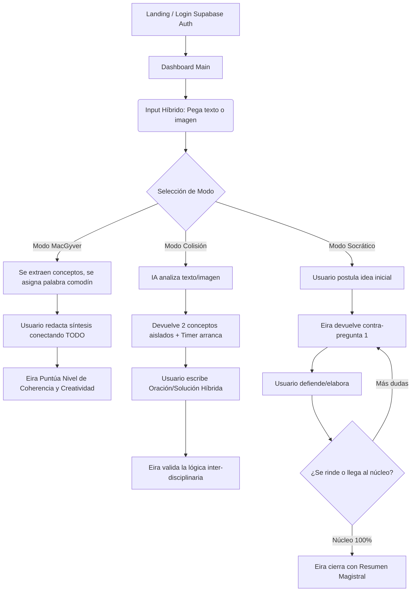

# EiraLearn: App Flow & State Management

## 🔄 State Management
- **Local State (Zustand o Context):** Para manejar el estado de las sesiones / chats actuales sin estar llamando constantemente a la base de datos y ahorrar ancho de banda.
- **Gestión de Imágenes:** Un estado global pre-almacena el `base64` de la imagen en cliente para renderizar el preview instantáneo antes de la confirmación de subida.
