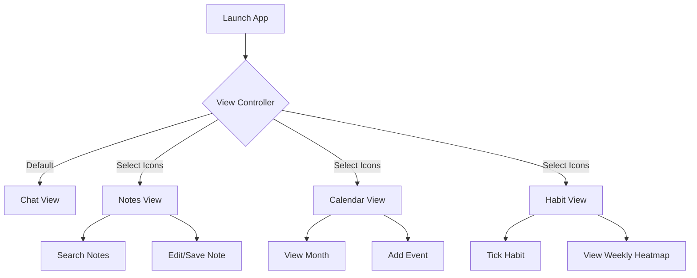

# App Flow: Eira Workspace

## Navigation Logic

- **Sidebar persist**: The sidebar remains visible regardless of the current module.
- **State persistence**: If the user is writing a note and switches to chat, the note content stays in state until saved/closed.
